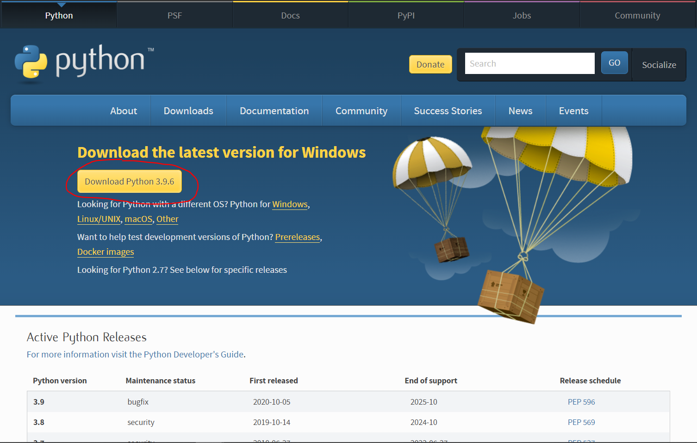
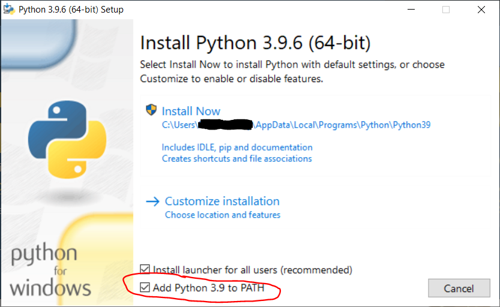
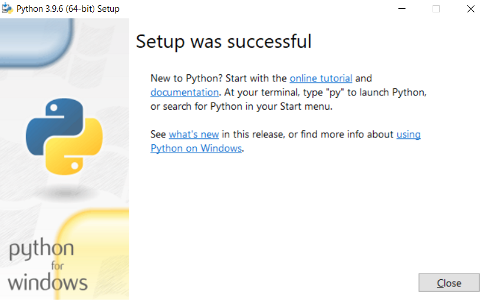
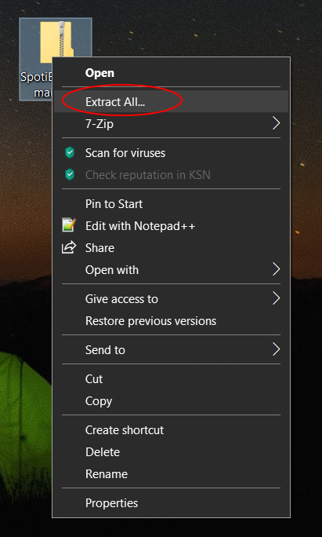
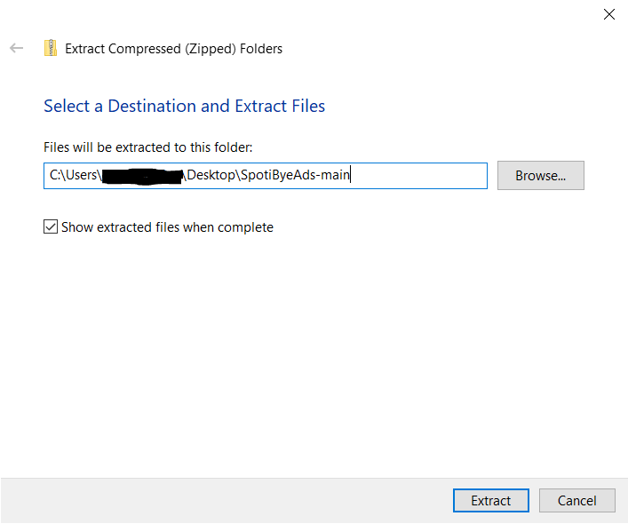

# Installation

(python-intallation)=
## Installing Python 3

(windows-installation)=
### Windows

If you already have Python 3, skip this section. Navigate to [python.org/downloads](https://www.python.org/downloads/). In this guide, we'll be installing the latest version of Python as it's the simplest way, but if you want you can install an older and more stable version.

Click on the large yellow button close to the top of the screen. Here it says "Download Python 3.9.6", but it may be slightly different for you.
Open the downloaded file. It should look something like this.

Make sure "Add Python to PATH" is checked towards the bottom. Click "Install Now", grant any permissions it asks for, and wait for it to complete.

If you see a screen something like this, you have successfully installed Python 3!

(ubuntu-installation)=
### Debian/Ubuntu

(project-download)=
## Downloading the project

Navigate to [github.com/daspartho/SpotiByeAds](https://www.github.com/daspartho/SpotiByeAds).

Click on the green button labeled "Code" and click on it. A drop down menu should appear. Press "Download ZIP".

(project-extraction)=
## Extracting the project

(win-extraction)=
### Windows

After downloading the ZIP file, right click on it and press "Extract All".

Choose where you want to extract the project to and press "Extract".

(package-installation)=
## Installing packages

Open Command Prompt or PowerShell on Windows or Terminal on Debian/Ubuntu. Type in the command `pip install spotipy pynput`. On Debian/Ubuntu you may need to type `pip3 install spotipy pynput`.
You should get a success message similar to `Successfully installed pynput-1.7.3 spotipy-2.18.0`, but it may be slightly different.

